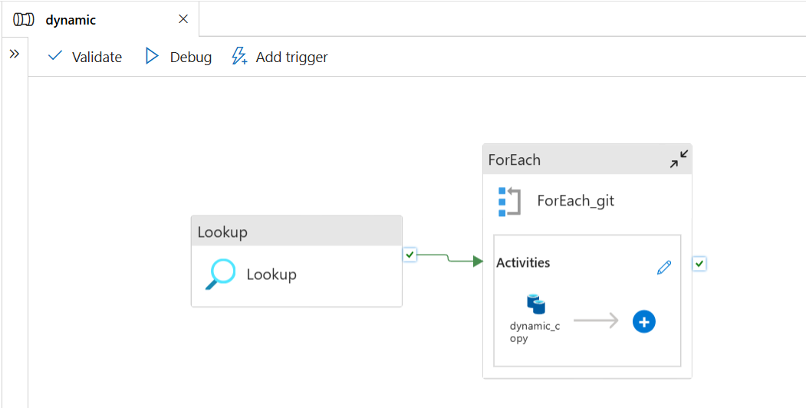

# 🚀 Azure End-to-End Data Engineering Pipeline (Medallion Architecture)

An end-to-end cloud data engineering pipeline built on **Microsoft Azure** using the **Medallion Architecture (Bronze → Silver → Gold)**. This project demonstrates automated API-driven ingestion into Azure Data Lake Storage (ADLS Gen2), ETL transformations using PySpark on Azure Databricks, and Serverless SQL modeling in Azure Synapse Analytics.

---

## 🏗️ Architecture Overview

The pipeline ingests raw operational datasets directly from GitHub via API, processes them through cleansing and aggregation layers, and serves analytical views for downstream reporting.


---

## 🔄 Data Pipeline Flow & Transformation

The pipeline dynamically orchestrates data processing from raw CSV files to optimized Parquet layers:

1. **API Ingestion & Bronze Layer:** Raw multi-source CSV files (`data/`) are fetched via API and loaded directly into Azure Data Lake Storage Gen2 (`bronze`).
2. **ETL Processing (ADF & Databricks):** Azure Data Factory orchestrates dynamic metadata lookups (`Lookup`) and iterates (`ForEach`) to trigger PySpark transformation scripts in Databricks.
3. **Silver Layer (Cleansed & Standardized):** PySpark handles data cleansing, schema enforcement, date standardization, and deduplication—storing output as compressed Parquet files in ADLS Gen2 (`silver`).
4. **Gold Layer (Analytical Servicing):** Azure Synapse Serverless SQL Pools define database-scoped credentials (via Managed Identity) and external data sources to build logical reporting views (`gold.Sales`, `gold.Customers`, `gold.Calendar`, etc.).



---

## 🛠️ Tech Stack & Azure Components

| Layer / Process | Technology | Purpose |
| :--- | :--- | :--- |
| **Data Lake Storage** | Azure Data Lake Storage Gen2 (ADLS) | Multi-container storage (`bronze`, `silver`, `gold`) |
| **Orchestration** | Azure Data Factory (ADF) | Dynamic pipeline execution using Lookup and ForEach activities |
| **Compute / Processing** | Azure Databricks (PySpark) | Data cleansing, schema conversion, and Parquet writing |
| **Data Warehouse / Serving** | Azure Synapse Serverless SQL Pools | SQL abstraction layer over Parquet files using `OPENROWSET` |
| **Security** | Managed Identities & Scoped Credentials | Keyless access control between Synapse and ADLS Gen2 |

---

## 📂 Repository Structure

```text
├── data/                         # Raw operational CSV datasets pulled via API
│   ├── Calender.csv
│   ├── Customers.csv
│   ├── Product_Category.csv
│   ├── Product_SubCategory.csv
│   ├── Products.csv
│   ├── Sales_2015.csv
│   ├── Sales_2016.csv
│   ├── Sales_2017.csv
│   ├── Territories.csv
│   └── returns.csv
├── databricks/
│   └── data_bricks_layer.ipynb   # PySpark ETL transformations & cleansing logic
├── SQL_SCRIPT/
│   ├── SQL_credentials.sql       # Database Scoped Credentials & External Data Sources
│   ├── SQL_encryption.sql        # Master Key setup & encryption management
│   └── gold_view.sql             # Gold layer views (Sales, Customers, Products, etc.)
├── docs/
│   ├── Medallion_arch.png        # High-level architecture diagram
│   └── Pipeline_1.png            # ADF pipeline workflow execution
└── README.md